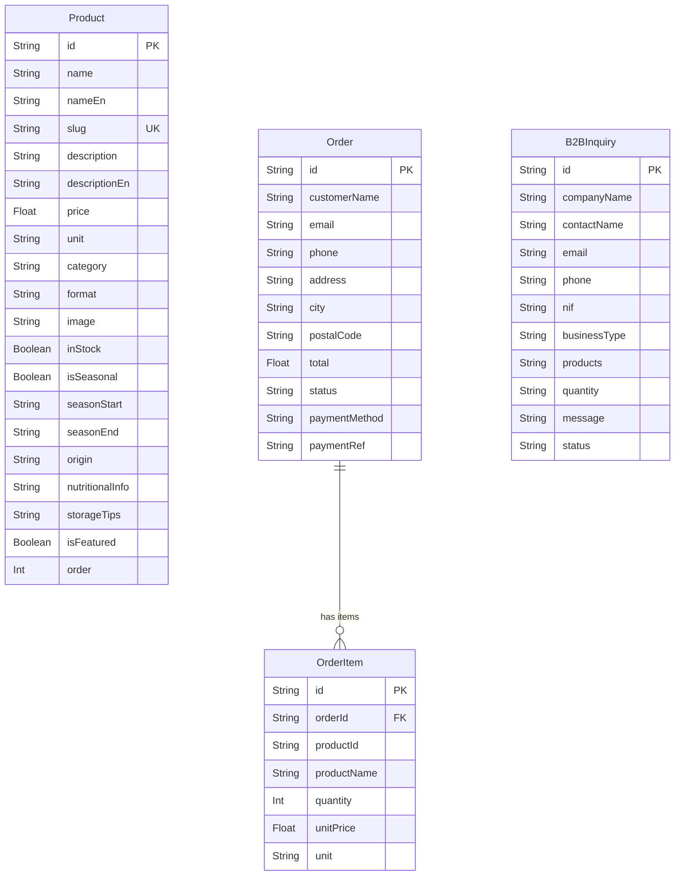

# 🍇 Lovelyproportion — E-Commerce Platform

> Premium farm-to-table e-commerce platform for **Lovelyproportion — Fruits Unipessoal Lda**, a Portuguese berry farm located in Sátão, Viseu. Specializing in small fruits (blueberries, raspberries, blackberries, currants) and strawberries.

---

## 📋 Table of Contents

- [Overview](#overview)
- [Features](#features)
- [Tech Stack](#tech-stack)
- [Architecture](#architecture)
- [Project Structure](#project-structure)
- [Database Schema](#database-schema)
- [API Reference](#api-reference)
- [Getting Started](#getting-started)
- [Environment Variables](#environment-variables)
- [Seeding](#seeding)
- [Design System](#design-system)
- [SEO](#seo)
- [Legal & Compliance](#legal--compliance)
- [Deployment](#deployment)

---

## 🌿 Overview

**Lovelyproportion** is a full-stack e-commerce platform built with Next.js 16, designed for the sale of fresh and frozen berries. The platform supports:

- **B2C** — Direct consumer sales with full checkout flow
- **B2B** — Wholesale inquiry system for restaurants and retailers
- **Seasonal inventory** — Products with availability windows (e.g., May–September)
- **Portuguese payment methods** — MB WAY, Multibanco, Credit Card (Visa/Mastercard), Bizum
- **Cold chain logistics** — Shipping with insulated packaging for fresh/frozen products

**Company Data:**
- **Razão Social:** Lovelyproportion — Fruits Unipessoal Lda
- **NIF:** 515444669
- **Sede:** Sátão, Viseu, Portugal
- **Tipo:** Sociedade Unipessoal
- **Experiência:** 7+ anos de produção própria

---

## ✨ Features

### Customer-Facing
| Feature | Description |
|---------|-------------|
| 🏠 **Hero Banner** | Full-viewport hero with AI-generated imagery, trust badges |
| 🌟 **Seasonal Highlights** | Featured products grid with stagger animations |
| 📖 **Company Story** | Animated stats (7+ years, 5+ varieties, 100% natural) |
| 🛒 **Product Catalog** | Filterable grid by category (Bagas, Arbustos, Morangos) and format (Fresco, Congelado, Cabaz Misto) |
| 🔍 **Product Detail** | Full product modal with nutritional info, origin, storage tips, seasonal availability |
| 🛍️ **Shopping Cart** | Persistent cart (localStorage) with quantity controls |
| 💳 **Checkout** | Customer form with Portuguese payment methods (MB WAY, Multibanco, Cartão de Crédito) |
| 📦 **Order Tracking** | Order creation with payment reference generation |
| 🏢 **B2B Portal** | Business inquiry form with company details and estimated quantities |

### Legal & Compliance
| Feature | Description |
|---------|-------------|
| 🔄 **Política de Reembolso** | DL 24/2014 compliant, 14-day return right, fresh/frozen product conditions |
| 🚚 **Política de Entrega** | Portugal Continental delivery, shipping cost table, cold chain logistics |
| 🛡️ **Política de Privacidade** | RGPD compliant, data collection purposes, 7 data subject rights, CNPD reference |
| 📖 **Livro de Reclamações** | Online complaints portal, direct contact, ADR entities (CIAB, CNIACC, EU ODR) |

### Technical
| Feature | Description |
|---------|-------------|
| 📱 **Mobile First** | Fully responsive, touch-friendly (44px min targets) |
| ⚡ **Server-Side Rendering** | Next.js 16 App Router with Turbopack |
| 🗄️ **SQLite Database** | Prisma ORM with file-based SQLite |
| 🔄 **React Query** | TanStack Query for server state with 60s stale time |
| 🐻 **Zustand** | Client state management (cart, UI state) with localStorage persistence |
| 🎨 **Design System** | Forest green palette, Playfair Display + DM Sans typography |
| ✨ **Animations** | Framer Motion entrance animations and hover effects |
| 🔔 **Toast Notifications** | User feedback for cart actions |
| 🖼️ **AI-Generated Images** | Product photography and hero banner via z-ai-web-dev-sdk |

---

## 🛠️ Tech Stack

| Category | Technology | Version |
|----------|-----------|---------|
| **Framework** | Next.js (App Router) | 16.1.x |
| **Language** | TypeScript | 5.x |
| **Runtime** | Bun | Latest |
| **Styling** | Tailwind CSS | 4.x |
| **UI Library** | shadcn/ui (New York) | Latest |
| **Icons** | Lucide React | 0.525.x |
| **Database** | SQLite (via Prisma) | 6.11.x |
| **ORM** | Prisma Client | 6.11.x |
| **State (Client)** | Zustand | 5.x |
| **State (Server)** | TanStack React Query | 5.x |
| **Animations** | Framer Motion | 12.x |
| **Forms** | React Hook Form + Zod | 7.x / 4.x |
| **AI SDK** | z-ai-web-dev-sdk | 0.0.18 |
| **Image Processing** | Sharp | 0.34.x |

---

## 🏗️ Architecture

```
┌─────────────────────────────────────────────────────────┐
│                     Browser (Client)                      │
│  ┌──────────┐  ┌──────────┐  ┌──────────┐  ┌─────────┐ │
│  │  Zustand  │  │ React    │  │  Framer  │  │shadcn/ui│ │
│  │  (Cart +  │  │  Query   │  │  Motion  │  │Components│ │
│  │  UI Store)│  │ (Server  │  │(Animate) │  │         │ │
│  └─────┬─────┘  │  State)  │  └──────────┘  └─────────┘ │
│        │         └────┬─────┘                            │
│        │              │ fetch('/api/...')                │
└────────┼──────────────┼──────────────────────────────────┘
         │              │
┌────────┼──────────────┼──────────────────────────────────┐
│        ▼              ▼         Next.js 16 (App Router)  │
│  ┌─────────────────────────────┐  ┌──────────────────┐   │
│  │     API Routes (/api/)      │  │  Prisma Client   │   │
│  │  ┌─────────┐ ┌───────────┐  │  │  (SQLite ORM)    │   │
│  │  │/products│ │/orders    │  │  └────────┬─────────┘   │
│  │  │/products│ │/b2b       │  │           │             │
│  │  │/[slug]  │ │           │  │           ▼             │
│  │  └─────────┘ └───────────┘  │  ┌──────────────────┐   │
│  └─────────────────────────────┘  │  SQLite Database │   │
│                                    │  (db/custom.db)  │   │
│                                    └──────────────────┘   │
└───────────────────────────────────────────────────────────┘
```

### Data Flow

1. **Page Load** → Next.js renders the single-page app with all sections
2. **Product Fetch** → TanStack Query calls `/api/products` with filter params
3. **Cart Actions** → Zustand store updates (persisted to localStorage)
4. **Checkout** → POST to `/api/orders` → Prisma creates Order + OrderItems
5. **B2B Inquiry** → POST to `/api/b2b` → Prisma creates B2BInquiry
6. **Policy Views** → Dialog modals with static legal content (no API call)

---

## 📁 Project Structure

```
lovely-web/
├── prisma/
│   ├── schema.prisma          # Database schema (4 models)
│   └── seed.ts                # Seed script (10 products)
├── db/
│   └── custom.db              # SQLite database file
├── public/
│   └── images/                # AI-generated product images
│       ├── hero-banner.png    # Hero section background
│       ├── mirtilos.png       # Blueberries
│       ├── framboesas.png     # Raspberries
│       ├── amoras.png         # Blackberries
│       ├── groselhas.png      # Currants
│       ├── morangos.png       # Strawberries
│       ├── cabaz-misto.png    # Mixed basket
│       └── congelados.png     # Frozen products
├── src/
│   ├── app/
│   │   ├── layout.tsx         # Root layout (fonts, metadata, providers)
│   │   ├── page.tsx           # Main page (assembles all sections)
│   │   ├── globals.css        # CSS variables, custom scrollbar
│   │   └── api/
│   │       ├── products/
│   │       │   ├── route.ts   # GET /api/products (with filters)
│   │       │   └── [slug]/
│   │       │       └── route.ts # GET /api/products/:slug
│   │       ├── orders/
│   │       │   └── route.ts   # POST /api/orders
│   │       └── b2b/
│   │           └── route.ts   # POST /api/b2b
│   ├── components/
│   │   ├── ui/                # shadcn/ui components (30+)
│   │   ├── header.tsx         # Sticky header + mobile menu
│   │   ├── hero.tsx           # Hero banner + trust badges
│   │   ├── seasonal-highlights.tsx  # Featured products grid
│   │   ├── company-story.tsx  # Company history + stats
│   │   ├── shop-section.tsx   # Product catalog + filters
│   │   ├── product-card.tsx   # Individual product card
│   │   ├── product-detail-dialog.tsx # Product detail modal
│   │   ├── cart-sheet.tsx     # Shopping cart sidebar
│   │   ├── checkout-dialog.tsx # Checkout form + payment
│   │   ├── b2b-section.tsx    # B2B inquiry form
│   │   ├── about-section.tsx  # Company info + contacts
│   │   ├── footer.tsx         # Footer + policies + payment icons
│   │   ├── policy-dialogs.tsx # Legal pages (4 dialogs)
│   │   └── providers.tsx      # TanStack Query provider
│   ├── store/
│   │   ├── cart-store.ts      # Cart state (Zustand + persist)
│   │   └── ui-store.ts        # UI state (filters, dialogs, policies)
│   ├── hooks/
│   │   ├── use-mobile.ts      # Mobile detection hook
│   │   └── use-toast.ts       # Toast notification hook
│   └── lib/
│       ├── db.ts              # Prisma client singleton
│       └── utils.ts           # Utility functions (cn, etc.)
├── .env                       # Environment variables
├── next.config.ts             # Next.js configuration
├── tailwind.config.ts         # Tailwind CSS configuration
├── tsconfig.json              # TypeScript configuration
├── eslint.config.mjs          # ESLint configuration
└── package.json               # Dependencies and scripts
```

---

## 🗄️ Database Schema



### Product Categories
| Category | Slug | Examples |
|----------|------|----------|
| Bagas (Berries) | `bagas` | Mirtilos, Framboesas, Amoras |
| Arbustos (Bushes) | `arbustos` | Groselhas |
| Morangos (Strawberries) | `morangos` | Morangos Frescos, Congelados |

### Product Formats
| Format | Slug |
|--------|------|
| Fresco (Fresh) | `fresco` |
| Congelado (Frozen) | `congelado` |
| Cabaz Misto (Mixed Basket) | `cabaz-misto` |

### Order Status Flow
```
pending → confirmed → shipped → delivered
```

### Payment Methods
| Method | Code | Reference Format |
|--------|------|-----------------|
| MB WAY | `mbway` | `MW{timestamp}` |
| Multibanco | `multibanco` | `MB{timestamp}` |
| Cartão de Crédito | `cartao` | `CC{timestamp}` |

---

## 🔌 API Reference

### Products

```http
GET /api/products
```

**Query Parameters:**

| Parameter | Type | Description |
|-----------|------|-------------|
| `category` | string | Filter by category: `bagas`, `arvore`, `arbustos`, `morangos` |
| `format` | string | Filter by format: `fresco`, `congelado`, `cabaz-misto` |
| `featured` | boolean | Only featured products (`true`) |
| `inStock` | boolean | Only in-stock products (`true`) |

**Response:** `Product[]`

```http
GET /api/products/:slug
```

**Response:** `Product`

---

### Orders

```http
POST /api/orders
```

**Request Body:**
```json
{
  "customerName": "João Silva",
  "email": "joao@email.com",
  "phone": "912345678",
  "address": "Rua das Flores, 10",
  "city": "Viseu",
  "postalCode": "3500-000",
  "paymentMethod": "mbway",
  "items": [
    {
      "productId": "cm...",
      "productName": "Mirtilos Frescos",
      "quantity": 2,
      "unitPrice": 8.90,
      "unit": "kg"
    }
  ]
}
```

**Response:** `{ success: true, order: Order }`

---

### B2B Inquiries

```http
POST /api/b2b
```

**Request Body:**
```json
{
  "companyName": "Restaurante Silva Lda",
  "contactName": "João Silva",
  "email": "joao@restaurante.pt",
  "phone": "912345678",
  "nif": "515444669",
  "businessType": "restauracao",
  "products": "mirtilos, framboesas",
  "quantity": "50 kg/semana",
  "message": "Informações adicionais..."
}
```

**Response:** `{ success: true, id: string }`

---

## 🚀 Getting Started

### Prerequisites

- [Bun](https://bun.sh/) >= 1.x
- Node.js >= 20.x (for compatibility)

### Installation

```bash
# Clone the repository
git clone https://github.com/AtlasGlobalCore/lovely-web.git
cd lovely-web

# Install dependencies
bun install

# Generate Prisma client
bun run db:generate

# Push database schema
bun run db:push

# Seed the database with sample products
bun run prisma/seed.ts

# Start development server
bun run dev
```

The application will be available at `http://localhost:3000`.

### Available Scripts

| Script | Command | Description |
|--------|---------|-------------|
| Development | `bun run dev` | Start Next.js dev server on port 3000 |
| Build | `bun run build` | Create production build |
| Start | `bun run start` | Run production build |
| Lint | `bun run lint` | Run ESLint |
| DB Push | `bun run db:push` | Push schema to SQLite |
| DB Generate | `bun run db:generate` | Generate Prisma client |
| DB Migrate | `bun run db:migrate` | Run Prisma migrations |
| DB Reset | `bun run db:reset` | Reset database |

---

## 🔐 Environment Variables

Create a `.env` file in the project root:

```env
# Database
DATABASE_URL="file:./db/custom.db"

# (Optional) NextAuth - if authentication is needed
# NEXTAUTH_SECRET="your-secret-here"
# NEXTAUTH_URL="http://localhost:3000"
```

---

## 🌱 Seeding

The seed script (`prisma/seed.ts`) populates the database with **10 products**:

| # | Product | Category | Format | Price | Seasonal |
|---|---------|----------|--------|-------|----------|
| 1 | Mirtilos Frescos | Bagas | Fresco | 8.90€/kg | ✅ Maio–Set |
| 2 | Framboesas Frescas | Bagas | Fresco | 10.50€/kg | ✅ Maio–Out |
| 3 | Amoras Frescas | Bagas | Fresco | 9.50€/kg | ✅ Jun–Set |
| 4 | Groselhas Frescas | Arbustos | Fresco | 11.90€/kg | ✅ Jun–Ago |
| 5 | Morangos Frescos | Morangos | Fresco | 6.50€/kg | ✅ Mar–Jun |
| 6 | Mirtilos Congelados | Bagas | Congelado | 7.50€/kg | ❌ |
| 7 | Framboesas Congeladas | Bagas | Congelado | 9.00€/kg | ❌ |
| 8 | Cabaz Pequenos Frutos Mistos | Bagas | Cabaz Misto | 24.90€/un | ✅ Maio–Set |
| 9 | Morangos Congelados | Morangos | Congelado | 5.50€/kg | ❌ |
| 10 | Amoras Congeladas | Bagas | Congelado | 8.50€/kg | ❌ |

---

## 🎨 Design System

### Color Palette

| Role | Color | Hex | Usage |
|------|-------|-----|-------|
| **Primary** | Forest Green | `#2D6A4F` | Buttons, links, headings |
| **Primary Dark** | Deep Forest | `#1B4332` | Header, footer, overlays |
| **Primary Light** | Spring Green | `#40916C` | Hover states |
| **Accent** | Mint | `#D8F3DC` | Badges, backgrounds |
| **Background** | Cream | `#FDF8F0` | Page background |
| **Card** | White | `#FFFFFF` | Cards, modals |
| **Text** | Dark Green | `#1B4332` | Headings |
| **Text Muted** | Sage | `#5C7A6B` | Body text |
| **Border** | Light Green | `#B7E4C7` | Borders, dividers |
| **Berry Red** | Ruby | `#9B2226` | Out of stock, cart badge |
| **Gold** | Cream Gold | `#FEFAE0` | Light text on dark |

### Typography

| Element | Font | Weight | CSS Variable |
|---------|------|--------|-------------|
| Headings | Playfair Display | 700 | `--font-playfair` |
| Body | DM Sans | 400/500/600 | `--font-dm-sans` |

### Component Standards

- **Border Radius:** `0.625rem` (default), `rounded-full` for pills/badges
- **Card Padding:** `p-4` (compact), `p-6` (standard), `p-8` (spacious)
- **Grid Gaps:** `gap-4` (compact), `gap-6` (standard)
- **Touch Targets:** Minimum 44×44px on mobile
- **Transitions:** `duration-300` (standard), `duration-500` (images)

---

## 🔍 SEO

### Target Keywords (PT)

- Mirtilos de Viseu
- Framboesas frescas Portugal
- Comprar mirtilos online
- Pequenos frutos Sátão
- Frutos vermelhos Portugal
- Morangos frescos Viseu

### Meta Tags

```html
<title>Lovelyproportion - Pequenos Frutos de Produção Própria</title>
<meta name="description" content="Pequenos frutos frescos e congelados de produção própria, colhidos com cuidado em Sátão, Viseu. Mirtilos, framboesas, amoras, groselhas e morangos." />
<meta name="keywords" content="pequenos frutos, mirtilos, framboesas, amoras, groselhas, morangos, produção própria, Sátão, Viseu, Portugal, frescos, congelados, orgânico, natural" />
<meta property="og:title" content="Lovelyproportion - Pequenos Frutos de Produção Própria" />
<meta property="og:locale" content="pt_PT" />
```

---

## ⚖️ Legal & Compliance

All legal pages are implemented as Dialog modals with full Portuguese legal content:

| Policy | Legal Basis | Key Points |
|--------|------------|------------|
| **Reembolso** | DL 24/2014 | 14-day return, fresh/frozen conditions, refund process |
| **Entrega** | Commercial terms | Portugal Continental, 24-48h fresh, cold chain, shipping tiers |
| **Privacidade** | RGPD (EU 2016/679) | 7 data subject rights, CNPD, data retention periods |
| **Reclamações** | Lei 144/2015 | Online portal, 20-day response, ADR entities |

### Payment Icons Displayed

| Method | Icon Style |
|--------|-----------|
| Visa | Blue background, white logo |
| Mastercard | Dark background, overlapping circles |
| MB WAY | Red background, white text |
| Bizum | Blue background, white text |
| Multibanco | Blue background, vertical bars |

---

## 🚢 Deployment

### Production Build

```bash
bun run build
bun run start
```

### Docker (Optional)

```dockerfile
FROM oven/bun:1
WORKDIR /app
COPY . .
RUN bun install --frozen-lockfile
RUN bun run db:generate
RUN bun run build
EXPOSE 3000
CMD ["bun", "run", "start"]
```

### Environment Considerations

- **Database:** SQLite file — ensure persistent volume in production
- **Images:** Currently served from `/public/images/` — consider CDN for scale
- **Payments:** Current implementation generates reference numbers — integrate with real payment gateway (SIBS, Easypay, Stripe) for production

---

## 📄 License

Private — © Lovelyproportion — Fruits Unipessoal Lda. All rights reserved.

---

<p align="center">
  <strong>Lovelyproportion — Fruits Unipessoal Lda</strong><br/>
  Sátão, Viseu, Portugal · NIF: 515444669<br/>
  <em>Do Campo Para a Sua Mesa 🍇</em>
</p>
